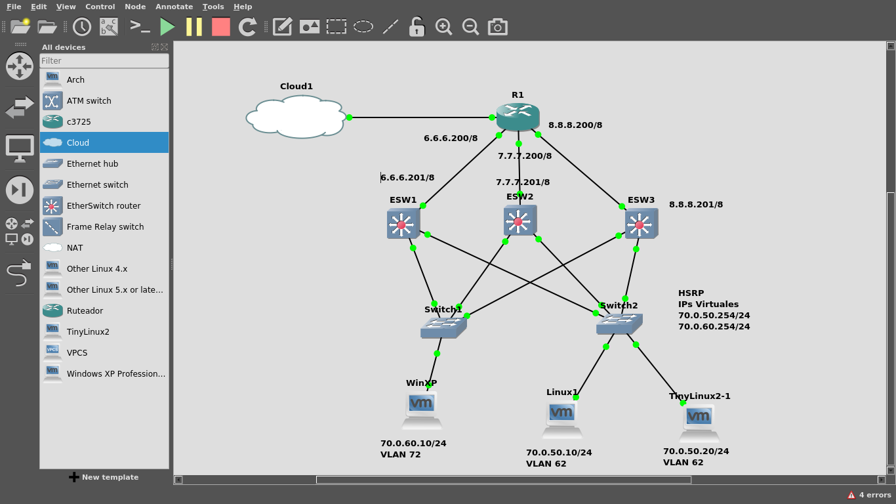
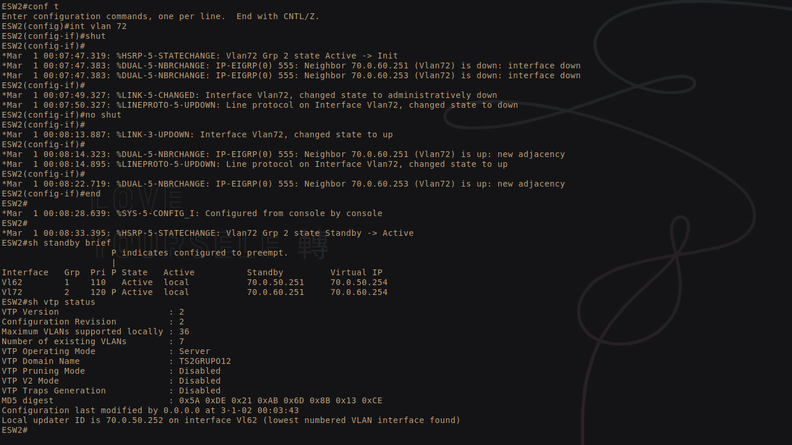
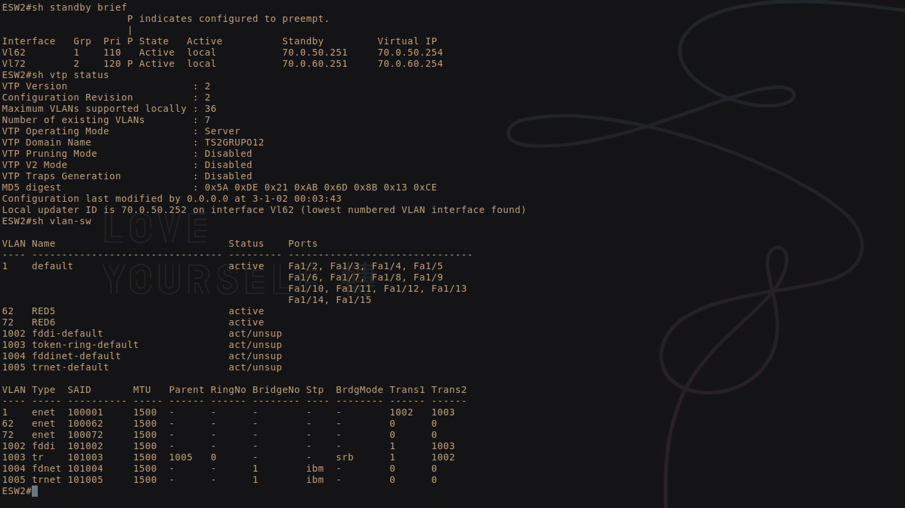
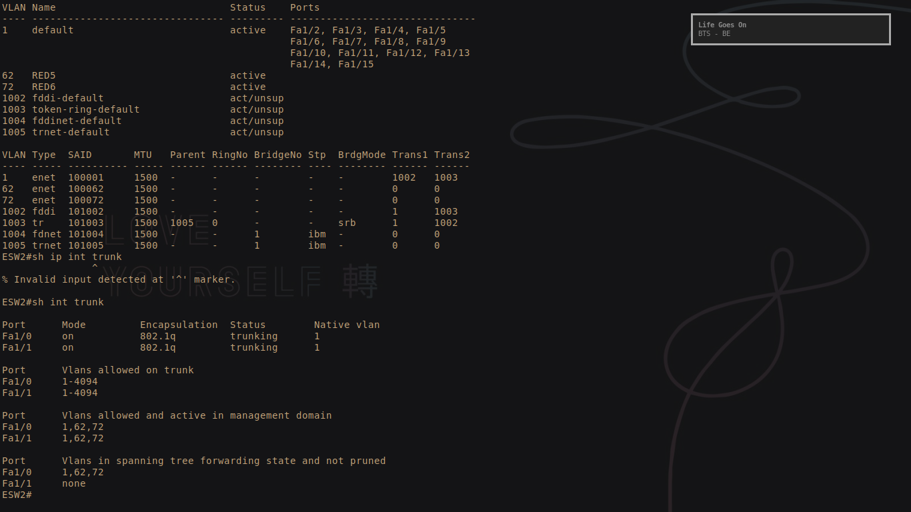
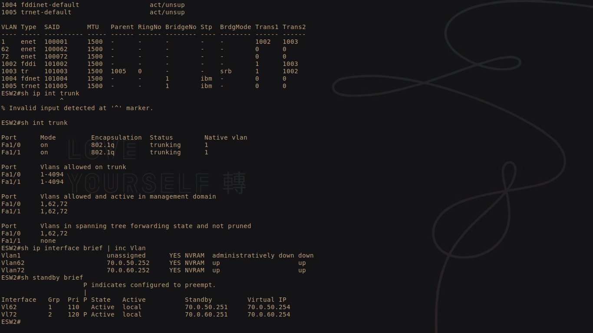
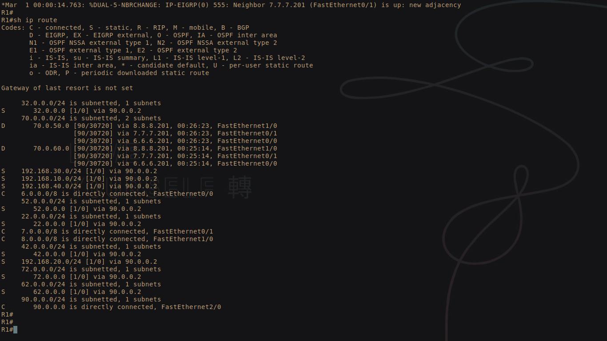
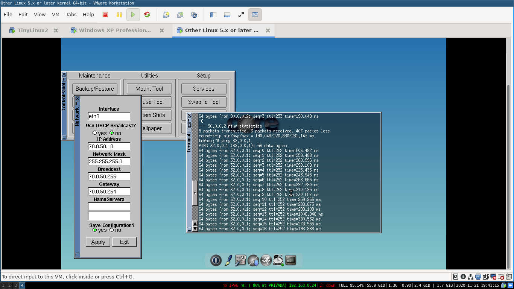

# Redes1-Proyecto_Grupo12
## 201700326
## 201709244

<h2>Topologia 2</h2>

## Configuracion

### Configuracion del VTP
Lo primero que haremos para implementar la topologia mostrada sera configurar 
el protocolo VTP en los 3 ESWs. Siendo el ESW2 el vtp maestro y el resto 
seran vtp clientes.
Los comandos a utilizar para el ESW2 son:
- conf t
- vtp domain TS2GRUPO12
- vtp password TS2GRUPO12
- vtp mode server
- end

Los comandos a utilizar para el ESW1 y 3 son:
- conf t
- vtp domain TS2GRUPO12
- vtp password TS2GRUPO12
- vtp mode client

Para verificar la configuracion, utilizar el comando sh vtp status.

### Creación de las VLANs

Una vez esta configurado el protocolo VTP en los ESW, se procede a 
crear las vlans en el ESW maestro (ESW2) para que estas sean posteriormente
propagadas a los otros ESW.
#### Comandos:
- conf t
- vlan {numero}
- name {nombre}
- end
  
Podemos ver en el ESW2 con el comando sh vlan-sw,
si estan todas las vlans creadas.

### Configuración de puertos
Configuramos los puertos en modo Trunk para admitir conexión intervlan.

- conf t
- interface {interface}
- switchport mode trunk
- end

Pueden verificarse los puertos en modo tronco con el comando
sh int trunk

### Creacion de las interfaces vlan
Para implementar el correcto ruteo intervlan se procede a configurar 
una direccion IP para cada red vlan de la siguiente manera:

- conf t
- int vlan {VLAN NUMBER}
- ip address {IP ADDRESS} {MASCARA DE SUBRED}
- end

Hacemos el procedimiento en cada uno de los 3 ESWs asignandoles direcciones de
red validas dentro de cada vlan a las que estan asociadas. 
Puede verificarse la creacion de las interfaces vlan con el comando
sh ip interface brienf | inc Vlan

### Creacion del Gateway Virtual
Para implementar el protocolo de redundancia en el Gateway se escogio el 
protocolo HSRP. Se designo como equipo activo al ESW2, el ESW1 como standby
y finalmente el ESW3 como estado listen que asumira el estado de activo 
como ultimo en prioridad.

- conf t
- int vlan {VLAN NUMBER}
- standby 1 70.0.50.254
- standby 1 priority 120
- standby 1 preempt delay minimum 5
- end

Repetimos el procedimiento en cada Router con la misma direccion de red virtual, pero cambiando el numero de 
grupo y el numero de prioridad (la prioridad mas alta para el ESW2, luego el ESW1 y finalmente la mas
baja para el ESW3)
 
Puede verificarse la correcta configuracion del protocolo con el comando sh standby brief

### Ruteo dinamico

### EIGRP

Procedemos a configurar el para el ruteo dinamico 
dentro de la topologia.

##### Comandos
- conf t
- router eigrp 555
- network 70.0.50.0 0.0.0.255
- network 70.0.60.0 0.0.0.255
- network 8.0.0.0 0.255.255.255
- no auto-summary
- end

### Ruteo estatico

Finalmente procedemos a configurar el ruteo estatico hacia
las redes de la topologia 1, siguiendo el formato:

#### R3
- conf t
- ip route {NETWORK IP} {MASK} {TARGET INTERFACE}

Realizamos este proceso para todas las 10 redes de la topologia
1 en cada uno de los ESW y en el Router R1.  
Finalmente comprobamos todas las redes aprendidas por el Router 
con el comando sh ip route.

Finalmente comprobamos realizando un ping a clientes de la topología 1.

